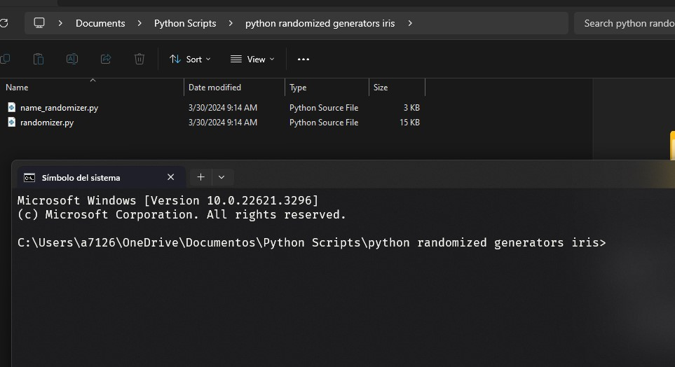

# iris-generators-py-script
Python Script that randomizes the values in "generators" for the minecraft plugin Iris.

## Usage: 
Have both scripts in the same folder, execute them opening your terminal and going to the directory where you have them downloaded.
Alternatevily, instead of writing down your path, you can just right click on your folder, and open the terminal directly in there.

