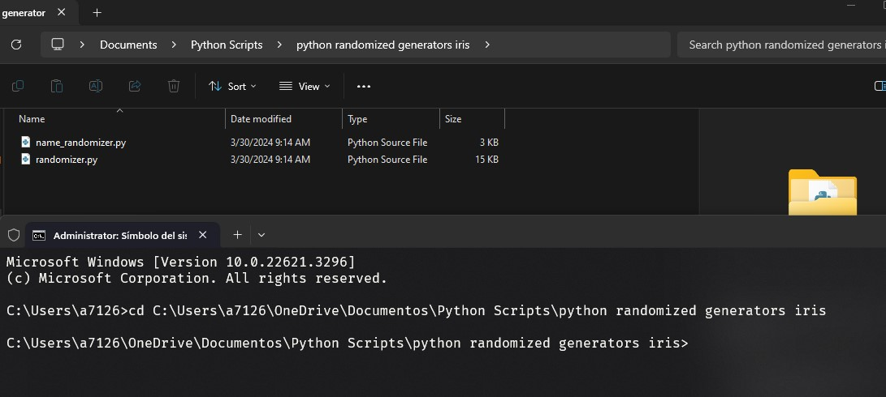

# iris-generators-py-script
Python Script that randomizes the values in "generators" for the minecraft plugin Iris.

# Please install Python if you don't have it.

## Usage: 
Have both scripts in the same folder, execute them opening your terminal and going to the directory where you have them downloaded.

Alternatevily, instead of writing down your path, you can just right click on your folder, and open the terminal directly in there.

## Execution:

### Once you are in the working directory, execute the following command "python randomizer.py", and hit Enter.

### You can choose between 4 templates, the console will ask you to input a number from 1 to 4. If you fail to comply with this, the script will just generate the default template, so the first one.

### Once you're done generating, you just need to execute the name_randomizer script, so this command "python name_randomizer.py", and hit Enter.

## And that's it, you can now drag your new randomized generators to your Iris pack, make sure to separate them in distinctive folders so you don't confuse them inside your pack folder.
## Make sure to have a "generators" folder inside your pack, if you don't have one, which I really doubt it, you should create a new one. 

### Once you have your generators in your folder, use the following command in console /iris std generator generator=your/path/filename

### This new window will open, you have to give it some time depending on the generator you opened, it takes some time to render, as you can see mine hasn't been rendered yet.

